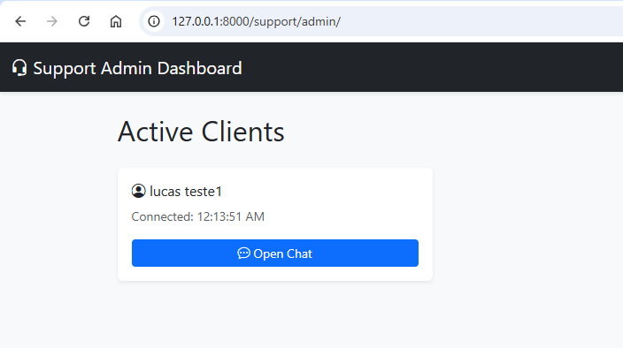
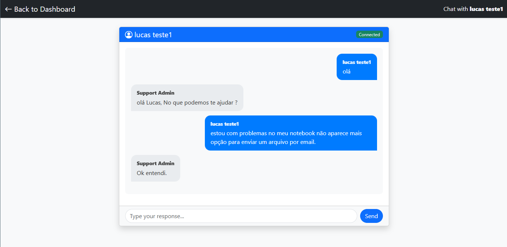

# Django Channels Chat - Real-Time WebSocket Chat

A simple, educational Django project demonstrating real-time chat functionality using Django Channels and WebSockets.





## Project Overview

This project showcases:
- **Django Channels** for WebSocket support
- **ASGI** application server configuration
- **WebSocket Consumer** for handling real-time communication
- **Redis** as the channel layer for multi-process deployment
- **Bootstrap 5** for responsive UI
- **Vanilla JavaScript** for WebSocket client management

## Project Architecture

```
Client (Browser)
      ↓ (WebSocket)
Daphne (ASGI Server)
      ↓
Django Channels Consumer
      ↓
Redis Channel Layer
```

**Components:**
- **Frontend:** HTML, CSS, JavaScript (vanilla)
- **Backend:** Django + Django Channels
- **WebSocket Server:** Daphne (ASGI)
- **Message Broker:** Redis
- **Database:** SQLite (development)
 

## Install

[install](./INSTALL.md) 

## Project Structure

```
django-channels-chat/
├── manage.py                    # Django management script
├── requirements.txt             # Python dependencies
├── .env.example                # Example environment variables
├── docker-compose.yml           # Redis container configuration
├── README.md                    # This file
│
├── ProjectChannels/             # Main Django project
│   ├── settings.py             # Django settings (ASGI, Channels config)
│   ├── asgi.py                 # ASGI application with WebSocket routing
│   ├── urls.py                 # Main URL router
│   ├── wsgi.py                 # WSGI application (production)
│   └── __init__.py
│
└── chat/                        # Chat application
    ├── models.py               # Message model for persistence
    ├── views.py                # HTTP views (index, room)
    ├── consumers.py            # WebSocket consumer (handles WS events)
    ├── routing.py              # WebSocket URL routing
    ├── urls.py                 # HTTP URL routing
    ├── admin.py                # Django admin configuration
    ├── apps.py                 # App configuration
    ├── tests.py                # Unit tests
    ├── __init__.py
    │
    ├── migrations/
    │   └── __init__.py
    │
    ├── templates/chat/
    │   ├── index.html          # Home page (enter username)
    │   └── room.html           # Chat room page
    │
    └── static/
        ├── css/
        │   └── style.css       # Chat styling (Bootstrap + custom)
        └── js/
            └── chat.js         # WebSocket client (ChatWebSocket class)
```
  